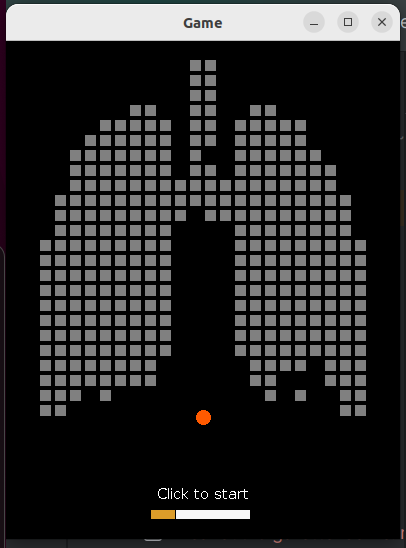
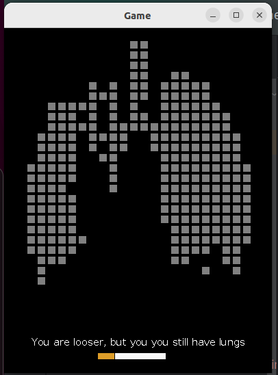
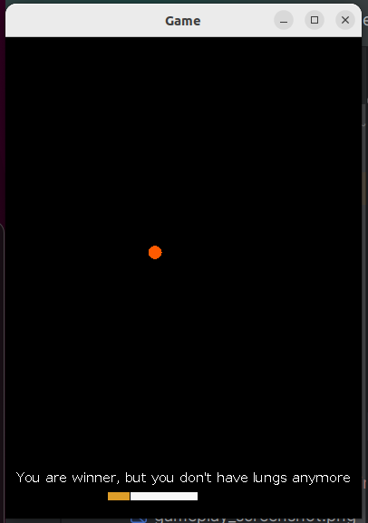

# Breakout Cigarette Game

This is a simple breakout game implemented in Java using the ACM graphics library. The goal of the game is to break all the target objects using the ball and the cigarette (racket). Below are the details and instructions for running the game.

## Game Overview

The game consists of the following components:

- Cigarette (Racket): Used to hit the ball and break target objects.
- Target Objects: Objects that need to be broken by hitting them with the ball.
- Ball: Moves around the game area and bounces off walls and objects.

## Game Controls

- Move the cigarette (racket) using your mouse. The cigarette will follow the horizontal movement of the mouse within the game window.
- Click anywhere on the game window to start the game.
- To enable autoplay mode, set the `autoPlay` variable to `true` in the code. This mode allows the game to play automatically without user interaction.

## Auto-Play Mode

In autoplay mode, the game will automatically control the racket to prevent the ball from falling down. This mode is useful for testing purposes or when the user wants to observe the game without actively playing.

## How to Run the Game

1. Ensure you have Java installed on your system.
2. Clone or download the source code of the game.
3. Open the project in an IDE (Integrated Development Environment) that supports Java.
4. Compile and run the `Game.java` file.

## Application Window Size

The application window size is dynamically adjusted by the library each time the program is run. This ensures that the code relies on the `getWidth()` and `getHeight()` methods rather than hardcoded values, preventing any breakages and ensuring compatibility across different platforms and screen sizes.
