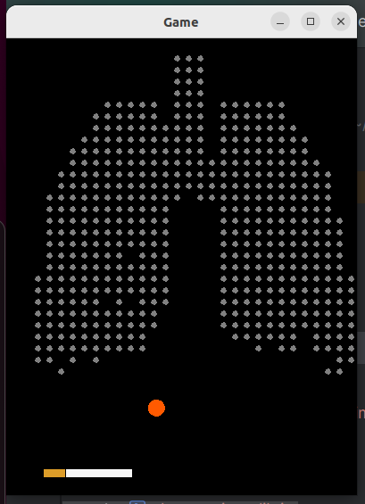

# Breakout Cigarette Game

This is a simple breakout game implemented in Java using the ACM graphics library. The goal of the game is to break all the target objects using the ball and the cigarette (racket). Below are the details and instructions for running the game.

## Game Overview

The game consists of the following components:

- Cigarette (Racket): Used to hit the ball and break target objects.
- Target Objects: Objects that need to be broken by hitting them with the ball.
- Ball: Moves around the game area and bounces off walls and objects.

## How to Run the Game

1. Ensure you have Java installed on your system.
2. Clone or download the source code of the game.
3. Open the project in an IDE (Integrated Development Environment) that supports Java.
4. Compile and run the `Game.java` file.

